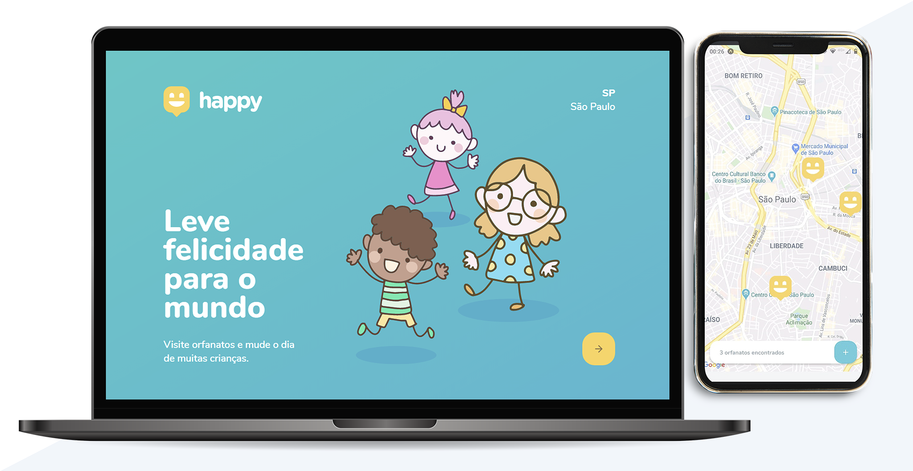

<h1 align="center">
    
</h1>

  <a href="#-tecnologias">Tecnologias</a>&nbsp;&nbsp;&nbsp;|&nbsp;&nbsp;&nbsp;
  <a href="#-projeto">Projeto</a>&nbsp;&nbsp;&nbsp;|&nbsp;&nbsp;&nbsp;
  <a href="#-layout">Layout</a>&nbsp;&nbsp;&nbsp;|&nbsp;&nbsp;&nbsp;
  <a href="#-licença">Licença</a>

  

## 🚀 Tecnologias

Projeto desenvolvido na 3ª edição da [Next Level Week](https://nextlevelweek.com/) - Trilha Omnistack, utilicando as seguintes tecnologias:

- [Node.js](https://nodejs.org/en/)
- [React](https://reactjs.org)
- [React Native](https://facebook.github.io/react-native/)
- [Expo](https://expo.io/)
- [TypeScript](https://www.typescriptlang.org/)

## 💻 Projeto

O Happy é uma aplicação que conecta pessoas à casas de acolhimento institucional para fazer o dia de muitas crianças mais feliz 💜

## 🔖 Layout

Layouts web e mobile disponíveis no [Figma](http://figma.com/):

- [Layout Web](https://www.figma.com/file/rbgYDHf2r03Mxa5k4v7aPM/Happy-Layout-Web)
- [Layout Mobile](https://www.figma.com/file/BIuorogzIYCWW6sDXygxhs/Happy-Layout-Mobile)

## 📝 Licença

Esse projeto está sob a [licença MIT](https://github.com/rocketseat-education/nlw-03-omnistack/blob/master/LICENSE.md).

---

  Desenvolvido com 💜 by Patricia Felix

---